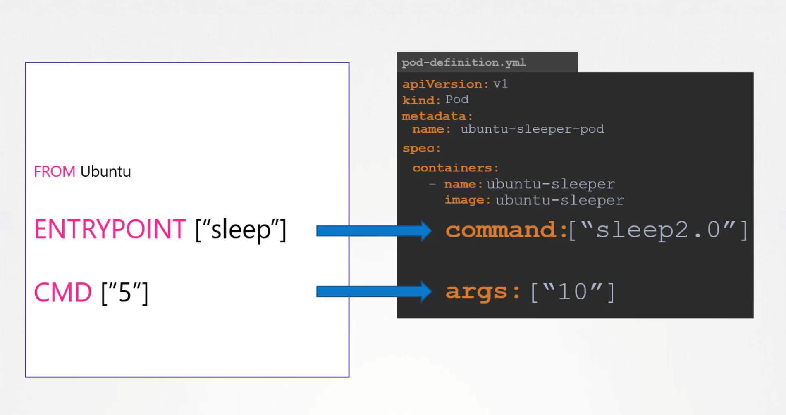

<div align="center">
  <h1><strong>CKA Exam Notes</strong></h1>
  <h3>Application Lifecycle Management</h3>
</div>

## Rolling Updates and the RollingUpdate Strategy

A Rolling Update is the default update strategy for Deployments. Instead of terminating all old Pods and starting all new ones at once (which can cause downtime), Kubernetes updates Pods incrementally, ensuring some Pods are always available during the process.

#### 🛠️ RollingUpdate Strategy Parameters

```yaml
strategy:
  type: RollingUpdate
  rollingUpdate:
    maxUnavailable: 1 # Number or percentage of Pods that can be unavailable during the update.
    maxSurge: 1 # Number or percentage of extra Pods (above desired count) that can be created temporarily during the update.
```

#### Use Case Example:

You're deploying a new version of your app (v2), replacing the old one (v1):

```bash
kubectl set image deployment my-app my-container=my-app:v2
```

> This triggers a rolling update based on the above strategy.

#### 🧯Rollback Support

```bash
kubectl rollout undo deployment my-app
```

#### 📋 Checking Rolling Update Status

```bash
kubectl rollout status deployment my-app
```

### 📦 Other Strategies: Recreate Strategy:

Terminates all old Pods first, then creates new ones.

```yaml
strategy:
  type: Recreate
```

## Commands and Arguments



### Summary

| Docker Concept | Kubernetes Field | Notes                         |
| -------------- | ---------------- | ----------------------------- |
| `ENTRYPOINT`   | `command`        | Overrides entrypoint in image |
| `CMD`          | `args`           | Passed as args to entrypoint  |

### For Passing Command to the POD

```bash
kubectl run ngninx-pod --image nginx --command python app.py
```

```yaml
- command:
    - python
    - app.py
```

### For Passing args to the pod

```bash
kubectl run ngninx-pod --image nginx -- "--color" blue
```

```yaml
- args:
    - --color
    - green
```

## Configuring Environment Variables

Direct assignment of key-value pairs in Pod/Deployment spec:

```yaml
env:
  - name: ENVIRONMENT
    value: "production"
  - name: DEBUG_MODE
    value: "false"
```

**Key Points:**

- Simple static values
- Hardcoded in manifest
- Good for non-sensitive, unchanging data

## 2. ConfigMap

### Imperative Commands

```bash
# Create from literals
kubectl create configmap app-config --from-literal=ENVIRONMENT=production --from-literal=DEBUG_MODE=false

# Create from file
kubectl create configmap app-config --from-file=config.properties

# Create from directory
kubectl create configmap app-config --from-file=config-dir/
```

### Usage in Pod

```yaml
# Load all key-value pairs using envFrom
envFrom:
  - configMapRef:
      name: my-config

# OR Load specific key using env
env:
  - name: ENVIRONMENT
    valueFrom:
      configMapKeyRef:
        name: app-config
        key: ENVIRONMENT
```

**Key Points:**

- Non-sensitive configuration data
- Can be updated without rebuilding image
- Supports key-value pairs and files

## 3. Secret

### Imperative Commands

```bash
# Create from literals
kubectl create secret generic app-secret --from-literal=DB_PASSWORD=mysecret --from-literal=API_KEY=abc123

# Create from file
kubectl create secret generic app-secret --from-file=credentials.txt

# Create TLS secret
kubectl create secret tls tls-secret --cert=path/to/cert.crt --key=path/to/key.key

# Create docker-registry secret
kubectl create secret docker-registry regcred --docker-server=myregistry.com --docker-username=user --docker-password=pass
```

#### Types

- `generic` - Arbitrary user-defined data
- `docker-registry` - Docker registry credentials
- `tls` - TLS certificates and keys
- `service-account-token` - Service account tokens

### Usage in Pod

```yaml
# Load all keys with envFrom
envFrom:
  - secretRef:
      name: app-secret

# OR Load individual key with env
env:
  - name: DB_PASSWORD
    valueFrom:
      secretKeyRef:
        name: app-secret
        key: DB_PASSWORD
```

### Private Registry Authentication

For pulling images from private registries, credentials must be provided to Kubernetes.

### 1. Create Docker Registry Secret

```bash
kubectl create secret docker-registry <secret-name> \
  --docker-username=<username> \
  --docker-password=<password> \
  --docker-email=<email> \
  --docker-server=<registry-url>
```

### 2. Attach Secret to Pod/Deployment

```yaml
spec:
  containers:
    - name: private-reg-container
      image: <your-private-image>
  imagePullSecrets:
    - name: <secret-name>
```

**Key Points:**

- Base64 encoded sensitive data
- Passwords, tokens, certificates
- Not encrypted at rest by default (use encryption at rest)
- Limited to 1MB per Secret
- **Declarative approach requires manual base64 encoding:** `echo -n 'password' | base64`

## Scaling Pods

Both HPA and VPA require metrics server or monitoring adapter setup to function properly.

### Manual Scaling

**Monitor Resources:**

```bash
kubectl top pod
kubectl top nodes
```

Shows current CPU and memory usage for pods and nodes.

**Scale Deployment:**

```bash
kubectl scale deployment my-deploy --replicas=5
```

### HPA - Horizontal Pod Autoscaler

HPA is a built-in Kubernetes feature that automatically scales pods horizontally based on resource metrics.

**Key Points:**

- Scales number of pod replicas up/down
- Based on CPU, memory, or custom metrics
- Requires metrics server to be installed
- Default check interval: 15 seconds

**Create HPA:**

```bash
# Imperative command
kubectl autoscale deployment my-deploy --min=2 --max=10 --cpu-percent=70

# Generate YAML
kubectl autoscale deployment my-deploy --min=2 --max=10 --cpu-percent=70 --dry-run=client -o yaml > hpa.yaml
```

**Check HPA Status:**

```bash
kubectl get hpa
kubectl describe hpa my-deploy
```

**Important HPA Behavior:**

- Scale up: Quick response when threshold exceeded
- Scale down: Gradual (5-minute cooldown by default)
- Target utilization is average across all pods

### VPA - Vertical Pod Autoscaler

VPA is **not** a built-in Kubernetes feature and must be installed separately.

**Key Points:**

- Adjusts CPU and memory requests/limits for containers
- Three update modes: `Off`, `Initial`, `Auto`
- Requires pod restart for resource changes (in Auto mode)
- Cannot be used with HPA on CPU/memory metrics

**VPA Components:**

1. **VPA Recommender** - Analyzes resource usage and provides recommendations
2. **VPA Updater** - Terminates pods that need resource updates
3. **VPA Admission Controller** - Sets resource requests on new pods

**VPA Modes:**

- `Off`: Only provides recommendations, no automatic changes
- `Initial`: Sets resources only when pods are created
- `Auto`: Automatically updates resources and restarts pods

**Check VPA:**

```bash
kubectl get vpa
kubectl describe vpa my-app-vpa
```

### Best Practices

**HPA:**

- Set appropriate min/max replicas to avoid resource waste or shortage
- Use multiple metrics (CPU + memory) for better scaling decisions
- Monitor scaling events and adjust thresholds as needed

**VPA:**

- Start with `Off` mode to analyze recommendations
- Use `Initial` mode for new deployments
- Be cautious with `Auto` mode due to pod restarts
- Set resource limits to prevent over-allocation

**General:**

- Never use HPA and VPA together on same resource metrics
- Ensure metrics server is properly configured
- Test scaling behavior in non-production first
- Monitor cluster resource capacity during scaling events
