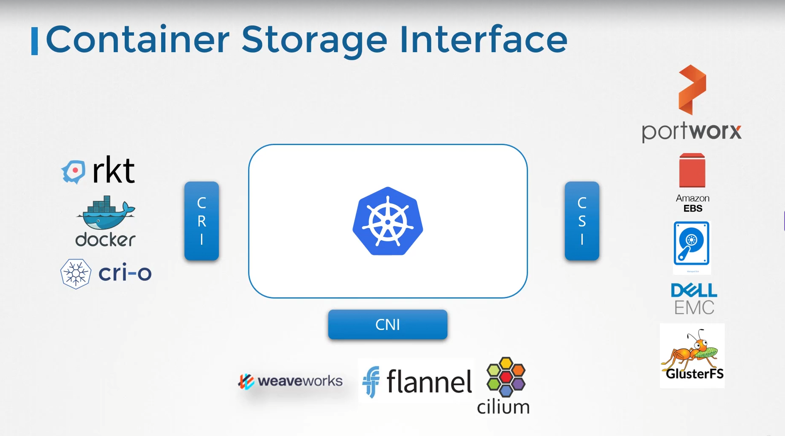

<div align="center">
  <h1><strong>CKA Exam Notes</strong></h1>
  <h3>Storage</h3>
</div>

---

**Interfaces in Kubernetes are standards defined by Kubernetes to allow easy integration with third-party tools or vendors. These interfaces make Kubernetes flexible and pluggable.**

**Example:** Initially, Kubernetes only supported Docker as the container runtime. But as new runtimes like `CRI-O` and `containerd` emerged, Kubernetes introduced the CRI (Container Runtime Interface). This standard allows any container runtime to work with Kubernetes if it follows the CRI specification—**no changes to Kubernetes core are needed**.

Similarly:

- `CRI` – Container Runtime Interface (for runtimes like `containerd`, `CRI-O`)
- `CNI` – Container Network Interface (for plugins like `Calico`, `Flannel`)
- `CSI` – Container Storage Interface (for storage providers like `EBS`, `Ceph`)

These interfaces allow Kubernetes to support different runtimes, network solutions, and storage backends in a standardized way.



---

## 🫙 VOLUMES (Non-Persistent)

Used within Pod spec — temporary storage, gone after Pod dies.

Common types:

- emptyDir: Created when Pod starts, deleted when Pod is removed.
- hostPath: Maps a path on host node.
- configMap, secret: Mount ConfigMap/Secret into container.
- nfs: Use remote NFS share.

```yaml
volumes:
  - name: myvol
    emptyDir: {}

volumeMounts:
  - mountPath: /data
    name: myvol
```

## 📦 PERSISTENT VOLUME (PV)

Cluster-wide storage resource.

```yaml
spec:
  capacity:
    storage: 1Gi
  accessModes:
    - ReadWriteOnce # RWO | ROX | RWX
  persistentVolumeReclaimPolicy: Retain # Retain | Delete
  storageClassName: manual
  hostPath:
    path: /pv/data
```

Key Points:

- **accessModes**: Controls how volume can be mounted (by how many Pods).

- **reclaimPolicy**:
  - `Retain`: Data persists even after PVC deleted.
  - `Delete`: Deletes backend storage.
- **storageClassName**: Should match PVC's.

## 🧾 PERSISTENT VOLUME CLAIM (PVC)

```yaml
spec:
  accessModes:
    - ReadWriteOnce
  resources:
    requests:
      storage: 1Gi
  storageClassName: manual
```

Key Points:

- PVC will bind to a matching PV (`storage`, `accessModes`, `storageClassName`).
- If no `storageClassName`, matches PV with same name or "".

### ⚙️ BINDING RULES

PVC looks for matching PV:

- Same `accessModes`
- Enough `storage`
- Same `storageClassName`

If volumeName is set in `PVC` → binds only to specific `PV`.

## 1. Mounting a hostPath Volume in a Pod

```yaml
spec:
  containers:
    - name: busybox
      image: busybox
      command: ["sleep", "3600"]
      volumeMounts:
        - name: data-vol
          mountPath: /data
  volumes:
    - name: data-vol
      hostPath:
        path: /pv/data
```

## 2. Using a PVC in a Pod

```yaml
spec:
  containers:
    - name: app
      image: nginx
      volumeMounts:
        - name: mypvc
          mountPath: /usr/share/nginx/html
  volumes:
    - name: mypvc
      persistentVolumeClaim:
        claimName: my-pvc
```

## 3.

```yaml
spec:
  replicas: 1
  selector:
    matchLabels:
      app: myapp
  template:
    metadata:
      labels:
        app: myapp
    spec:
      containers:
        - name: nginx
          image: nginx
          volumeMounts:
            - name: html
              mountPath: /usr/share/nginx/html
      volumes:
        - name: html
          persistentVolumeClaim:
            claimName: my-pvc
```

IMP:

- spec.template.spec.volumes
- spec.template.spec.containers[].volumeMounts

## StorageClasses:

Defines how to dynamically provision PVs.

```yaml
apiVersion: storage.k8s.io/v1
kind: StorageClass
metadata:
  name: my-storage-class
provisioner: kubernetes.io/no-provisioner # or dynamic provisioner like aws ebs, google etc.
volumeBindingMode: Immediate # or WaitForFirstConsumer
reclaimPolicy: Delete # or Retain
```

Key Points:

- provisioner: The plugin used to provision PVs
  - `kubernetes.io/aws-ebs` , `kubernetes.io/no-provisioner`
- reclaimPolicy:What happens to PV when PVC is deleted
  - `Retain` , `Delete`
- volumeBindingMode: When volume is bound
  - Immediate: The PV is create immediately when pvc createed.
  - WaitForFirstConsumer: Wait for consumer (pod, deploy) to be created.
