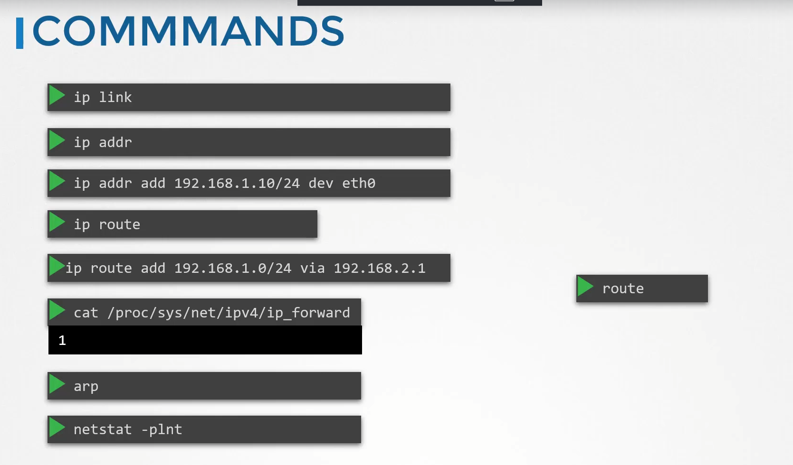
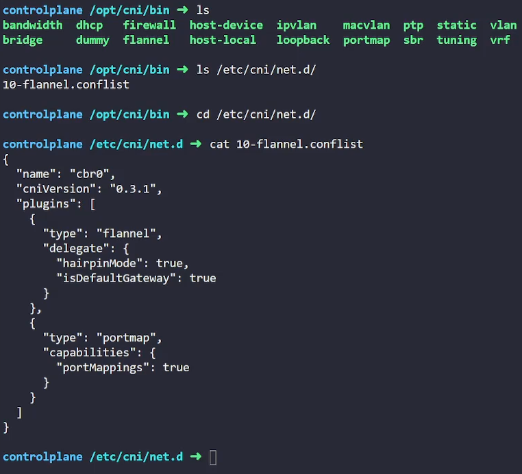
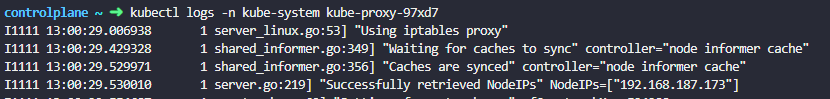

<div align="center">
  <h1><strong>CKA Exam Notes</strong></h1>
  <h3>Networking</h3>
</div>

## Basic



Q. How to check if the node is conected to which Network Interface?

Note the Internal IP address if the node:

```bash
k get nodes - o wide
```

**Output**:

```bash
NAME           STATUS   ROLES           AGE   VERSION   INTERNAL-IP      EXTERNAL-IP   OS-IMAGE             KERNEL-VERSION    CONTAINER-RUNTIME
controlplane   Ready    control-plane   34m   v1.33.0   192.168.63.147   <none>        Ubuntu 22.04.5 LTS   5.15.0-1083-gcp   containerd://1.6.26
node01         Ready    <none>          33m   v1.33.0   192.168.139.13   <none>        Ubuntu 22.04.5 LTS   5.15.0-1083-gcp   containerd://1.6.26
```

Check which network interface has that IP included.

```bash
ip address
# or
ip a
# or
ip a show type bridge
```

**Output**:

````bash
3: eth0@if2063: <BROADCAST,MULTICAST,UP,LOWER_UP> mtu 1410 qdisc noqueue state UP group default
    link/ether be:b9:ea:ae:ce:84 brd ff:ff:ff:ff:ff:ff link-netnsid 0
    inet 192.168.63.147/32 scope global eth0
       valid_lft forever preferred_lft forever
    inet6 fe80::bcb9:eaff:feae:ce84/64 scope link
       valid_lft forever preferred_lft forever
       ```
````

How to check the any type of interface(eg. bridge) on you machine?

```bash
ip address show type bridge
```

How to check the port of services on your machine?

```bash
netstat -h # Help

netstat -tnlp
```

How to check that what is the default network interface is being used to route traffic from a node?

```bash
ip route show default
```

## CNI



CNI (Container Network Interface) uses configuration files in `/etc/cni/net.d/` to specify which network plugin to use. The `type` field in the config maps to executable files in `/opt/cni/bin/`.

**Example:** `"type": "flannel"` → uses the `flannel` executable from the bin directory.

### Key Paths

**CNI Executables:**

```bash
ls /opt/cni/bin
```

**CNI Configuration:**

```bash
ls /etc/cni/net.d/
```

The configuration files tell your cluster which CNI plugin to use for networking.

1. How to check Node's IP Range

- `kubectl get node -o wide` and note down th ip of node
- `ip a` to get the network interface (eth0)
- if the netowrk Interface says Ip like `192.6.10.10/24` So /24 means last 8 beat are host part means the subnet will be `192.6.10.0/24`

2. How to check POD's IP Range?

Check the kube-controller-manager.yaml manifest file and look for the --cluster-cidr parameter, which defines the IP range assigned to Pods in the cluster.

```bash
cat /etc/kubernetes/manifests/kube-controller-manager.yaml
```

Look for `--cluster-cidr=172.17.0.0/16` This is POD's IP range

3. How to check Service Ip Range?

- ` cat /etc/kubernetes/manifest/kube-apiserver.yaml`
- Look for flag `--service-cluster-ip-range=172.20.0.0/16`

### Delete CNI from a cluster

- If you want to delete a `CNI` from a cluster instead of deleting the resources, such as `DaemonSet`, `ConfigMap`, `Deployment`, etc., simply delete the entire `namespace`.
- Delete the config file under `/etc/cni/net.d/xxx.config

### Installing CNI in cluster

- If you are installing new CNI and you need to chage the `CICR range` first download the `CustomResource` yaml file you can get the link from official docs and `curl` that command to get ti downloded.
- And then simply do kubectl apply -f /test.yml to apply the changes.

### How to chekc what kind of proxy the `kube-proxy` uses?

```bash
# Check the first line of the proxy
kubectl logs -n kube-system kube-proxy-pod-xxx
```



# Kubernetes Ingress Quick Reference

## Basic Ingress Creation

### Single Rule Ingress

```bash
kubectl create ingress critical-ingress --rule=/pay=pay-service:8080 --annotation=nginx.ingress.kubernetes.io/rewrite-target=/
```

**Generated YAML:**

```yaml
apiVersion: networking.k8s.io/v1
kind: Ingress
metadata:
  annotations:
    nginx.ingress.kubernetes.io/rewrite-target: /
    creationTimestamp: null
  name: critical-ingress
spec:
  rules:
    - http:
        paths:
          - backend:
              service:
                name: pay-service
                port:
                  number: 8080
            path: /pay
            pathType: Exact
```

### Multiple Hosts/Paths

```bash
kubectl create ingress multipath \
  --rule="path/=svc:80" \
  --rule="foo.com/admin/=svcadmin:8080"
```

## Rule Syntax

### Complete Rule Format

```bash
--rule="HOST/PATH=SERVICE:PORT"
```

**Example:** `--rule="parimal.com/example=svc:8080"`

### Path-Only (Any Host)

```bash
--rule="/PATH=SERVICE:PORT"
```

**Example:** `--rule="/example=svc:8080"`

### Host-Only (Root Path)

```bash
--rule="HOST/=SERVICE:PORT"
```

**Example:** `--rule="foo.com/=svc:8080"`

## Rule Components

- **HOST** — Domain name (e.g., `example.com`)
- **/PATH** — URL path prefix (e.g., `/admin`, `/api`)
- **SERVICE:PORT** — Backend service and port (e.g., `svc:8080`)

> **Note:** Remove the host part for any-host rules, remove the path part for root-path rules.

# Kubernetes Gateway API Quick Reference

## Overview

The Gateway API is a new, standardized way to expose applications to external traffic in Kubernetes. It improves on the limitations of the older Ingress resource.

## Core Resources

### 1. GatewayClass

- **Purpose:** Defines the Gateway Controller (Nginx, Istio, etc.)
- **Management:** Auto-created during setup

### 2. Gateway

- **Purpose:** Configuration for traffic entry point
- **Responsibilities:**
  - ✅ Which port(s) to listen on (80, 443)
  - ✅ Whether to use TLS (HTTPS)
  - ✅ Which HTTPRoutes are allowed to bind

### 3. HTTPRoute/TCPRoute

- **Purpose:** Traffic routing rules
- **Responsibilities:**
  - ✅ Which paths (e.g., `/video`, `/wear`) to match
  - ✅ Which backend Service to send the traffic to

> **Note:** GatewayClass is auto-created during setup. Gateway and HTTPRoute/TCPRoute are admin responsibility.

## Configuration Examples

### Gateway Definition

```yaml
apiVersion: gateway.networking.k8s.io/v1
kind: Gateway
metadata:
  name: my-gateway
  namespace: default
spec:
  gatewayClassName: nginx # Created by the controller
  listeners:
    - name: http
      protocol: HTTP
      port: 80
      allowedRoutes: # Which HTTPRoute resources can bind with the gateway
        namespaces:
          from: Same
```

### HTTPRoute Definition

```yaml
apiVersion: gateway.networking.k8s.io/v1
kind: HTTPRoute
metadata:
  name: video-route
  namespace: app-space
spec:
  parentRefs:
    - name: my-gateway # Match the Gateway
      namespace: default # If the gateway is in different namespace
  rules:
    - matches:
        - path:
            type: PathPrefix
            value: /video
      backendRefs:
        - name: video-service
          port: 8080
```

## Useful Commands

```bash
kubectl get gatewayclass
kubectl get gateways
kubectl get httproute
```
